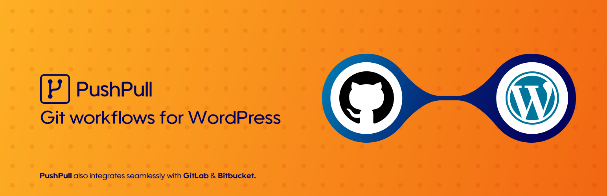

Git-backed content workflows for selected WordPress content domains.

Project homepage: https://creativemoods.pt/pushpull/

> This is a beta plugin. It is still under active development, has limited functionality, and currently supports only a narrow subset of the intended PushPull feature set.

## Description

PushPull stores selected WordPress content in a Git repository using a canonical JSON representation instead of raw database dumps.

This project is also documented through a DevOps-focused article series that explains how to efficiently manage a WordPress stack with Bedrock and PushPull, starting here: https://creativemoods.pt/devops-with-wordpress/

The current release supports these managed domains:

1. Primary domains:
   `generateblocks_global_styles`
   `generateblocks_conditions`
   `wordpress_block_patterns`
   `wordpress_categories`
   `wordpress_comments`
   `wordpress_menus`
   `wordpress_pages`
   `wordpress_posts`
   `wordpress_tags`
   `wordpress_custom_css`
   `generatepress_elements`
   `wordpress_attachments` (explicit opt-in only)
   generic discovered custom post types and taxonomies
2. Config domains:
   `wordpress_core_configuration`
   `wpml_configuration`
3. Overlay domains:
   `translation_management` (WPML-backed)
   `media_organization` (Real Media Library-backed)

PushPull keeps a local Git-like repository inside WordPress database tables, lets you compare live WordPress content against local and remote snapshots, and supports the full workflow from WordPress:

1. Test the remote GitHub or GitLab connection
2. Commit live managed content into the local repository
3. Initialize an empty remote repository
4. Fetch remote commits into a local tracking ref
5. Diff live, local, and remote states
6. Pull remote changes through fetch + merge
7. Merge remote changes into the local branch
8. Resolve conflicts when needed
9. Apply repository content back into WordPress
10. Push local commits to GitHub or GitLab

The plugin also includes:

1. A dedicated audit log screen
2. Local repository reset tooling
3. Remote branch reset tooling that creates one commit removing all tracked files from the branch
4. A dedicated Domains screen that separates WordPress core, installed plugin integrations, and discovered custom content
5. Global and per-domain managed-content views in the admin UI
6. A high-level PushPull status dropdown in the WordPress admin bar
7. Menu structure export and apply with hierarchy and theme location assignment
8. A scheduled lightweight remote-head check that highlights when `Fetch` likely has updates available
9. Bulk `Commit + Push All` and `Pull + Apply All` workflows for whole-site bootstrap and deploy flows
10. A `wp pushpull` WP-CLI command surface for status, configuration, domains, and sync operations

## Current scope

This is an early, focused release. At the moment, PushPull is intentionally limited to:

1. GitHub and GitLab as implemented remote providers
2. Managed domains across three families:
   `generateblocks/global-styles/`
   `generateblocks/conditions/`
   `wordpress/block-patterns/`
   `wordpress/categories/`
   `wordpress/comments/`
   `wordpress/menus/`
   `wordpress/pages/`
   `wordpress/posts/`
   `wordpress/tags/`
   `wordpress/custom-css/`
   `wordpress/attachments/`
   `wordpress/configuration/`
   `wpml/configuration/`
   `wordpress/generatepress-elements/`
   `wordpress/custom-post-types/<slug>/`
   `wordpress/custom-taxonomies/<slug>/`
   `translations/management/`
   `media/organization/`
3. Canonical JSON storage with one file per managed item for manifest-backed sets, plus directory-backed storage for attachments using `attachment.json` and the binary file
4. Explicit opt-in attachment sync through a media-library checkbox
5. Overlay domains that scope themselves to enabled compatible base domains rather than exporting every backend row blindly
6. A cached remote-head availability signal for `Fetch`, driven by a configurable recurring check instead of a live provider probe on every page load

It does not yet manage forms, users, arbitrary `wp_options`, or arbitrary plugin data.

## How PushPull represents content

PushPull does not use WordPress post IDs as repository identity.

For the currently supported managed sets it stores:

1. One canonical JSON file per managed item
2. One separate `manifest.json` file for manifest-backed sets that preserve logical ordering
3. One directory per attachment for the attachments set, containing `attachment.json` and the binary file
4. Stable logical keys instead of environment-specific database IDs
5. Canonical logical-key references for cross-domain relationships such as reading settings, translation groups, media folders, GeneratePress condition targets, and menu object references
6. Recursive placeholder normalization for current-site absolute URLs in post-type-backed content

That design keeps content stable across environments and makes reorder-only changes isolated and easy to review.

## Installation

### Uploading in WordPress Dashboard

1. Download the packaged plugin ZIP.
2. In WordPress, go to Plugins > Add New Plugin.
3. Click Upload Plugin.
4. Select the ZIP file.
5. Install and activate the plugin.

### Installing from source

1. Clone this repository into `wp-content/plugins/pushpull`.
2. Run `composer install`.
3. Activate PushPull in WordPress.

### Install via Composer / Packagist

In a Composer-managed WordPress project such as Bedrock:

1. Require the plugin:
   `composer require creativemoods/pushpull`
2. Make sure the root project allows `composer/installers` and installs `type: wordpress-plugin` packages into your plugins directory
3. Activate PushPull in WordPress

## Configuration

PushPull currently supports GitHub and GitLab repositories.

### Provider tokens

For GitHub, grant:

1. Repository metadata read access
2. Repository contents read and write access

For GitLab fine-grained personal access tokens, grant:

1. `Project: Read`
2. `Branch: Read`
3. `Commit: Read`
4. `Commit: Create`
5. `Repository: Read`

### Plugin settings

In PushPull > Settings:

1. Select `GitHub` or `GitLab` as the provider
2. Enter the repository owner and repository name
3. Enter the target branch
4. Enter the API token
5. Optionally set the remote fetch check interval in minutes
6. Click `Test connection`
7. Save the settings

### Domain selection

In PushPull > Domains:

1. Enable one or more managed domains
2. Review WordPress core, installed plugin integrations, and discovered custom content separately
3. Opt into generic discovered custom post types and taxonomies when you want them managed

### Empty repositories

If the configured GitHub or GitLab repository exists but has no commits yet, `Test connection` will report that the repository is reachable but empty.

In that case, click `Initialize remote repository`. PushPull will:

1. create the first commit on the configured branch
2. fetch that initial commit into the local remote-tracking ref
3. make the repository ready for normal commit, fetch, merge, apply, and push workflows

You no longer need to create the first commit manually on the provider before using PushPull.

### WP-CLI

PushPull also exposes a `wp pushpull` command.

Examples:

1. `wp pushpull status`
2. `wp pushpull domains`
3. `wp pushpull config list`
4. `wp pushpull config set branch main`
5. `wp pushpull config enable-domain wordpress_pages`
6. `wp pushpull commit wordpress_pages`
7. `wp pushpull push`
8. `wp pushpull commit-push-all`
9. `wp pushpull pull-apply-all`

## Workflow

The normal workflow is:

1. `Commit` to snapshot the current live managed-set content into the local repository
2. `Fetch` to import the current remote branch into `refs/remotes/origin/<branch>`
3. Inspect the live/local and local/remote diff views if needed
4. `Pull` for the common fetch + merge flow, or `Merge` manually after fetch when you want review first
5. `Apply repo to WordPress` when you want the local branch state written back into WordPress
6. `Push` when you want local commits published to GitHub

PushPull also performs a lightweight recurring remote-head check and visually highlights `Fetch` when the latest scheduled check suggests the remote branch has advanced since the last fetch.

For whole-site bootstrap flows, PushPull also supports:

1. `Commit + Push All` to snapshot and publish all enabled domains
2. `Pull + Apply All` to import and apply all enabled domains on a bare target site

If both local and remote changed, PushPull can persist conflicts, let you resolve them in the admin UI, and then finalize a merge commit.

When pushing to GitLab, PushPull currently linearizes local merge results into a normal commit on the remote branch instead of preserving merge topology. The merged tree content is preserved; only the remote Git history shape is flattened.

## Release checklist

See [`docs/releasing.md`](./docs/releasing.md) for the maintainer release process.

## TODO

1. Cache the admin-bar PushPull status summary so the high-level live/local and local/remote aggregation is not recomputed on every page view.
2. Move chunked async provider resumability fully into the provider layer so `BranchAsyncOperationCoordinator` no longer needs provider-specific GitLab staging rehydration logic.
3. Improve push progress and recap reporting to distinguish newly uploaded objects from objects reused from the remote history.
4. Surface unresolved logical-reference mapping issues, such as GeneratePress condition IDs that could not be converted to logical placeholders, instead of silently leaving mixed raw IDs and canonical refs.

## Changelog

See [`CHANGELOG.md`](./CHANGELOG.md) for the full release history.

## External services

PushPull connects to the GitHub or GitLab API for the repository you configure in the plugin settings.

The plugin uses the provider REST API to:

1. Read repository metadata and the default branch
2. Read and update branch refs
3. Read and create Git objects or provider-equivalent commit actions
4. Test repository access before sync operations

PushPull sends the following information to the configured provider over HTTPS:

1. The repository owner, repository name, branch, and API base URL
2. Your configured API token in the provider-specific authentication header
3. Canonical JSON representations of the managed content you choose to commit and push
4. Commit metadata such as commit messages and, if configured, author name and email

In the current release, the managed content sent to the provider is limited to the enabled supported domains: GenerateBlocks Global Styles, GenerateBlocks Conditions, WordPress Block Patterns, WordPress Categories, WordPress Comments, WordPress Menus, WordPress Pages, WordPress Posts, WordPress Tags, WordPress Custom CSS, GeneratePress Elements, explicitly opted-in WordPress Attachments, WordPress core configuration, generic discovered custom post types and taxonomies, WPML-backed translation management, and Real Media Library-backed media organization.

PushPull does not send your whole WordPress database to the provider. It only sends the managed content represented by the enabled adapters.

In the current release, the managed content sent to the provider is limited to the enabled supported domains: GenerateBlocks Global Styles, GenerateBlocks Conditions, WordPress Block Patterns, WordPress Menus, WordPress Pages, WordPress Posts, WordPress Custom CSS, GeneratePress Elements, explicitly opted-in WordPress Attachments, WordPress core configuration, WPML-backed translation management, and Real Media Library-backed media organization.

PushPull does not send your whole WordPress database to the provider. It only sends the managed content represented by the enabled adapters.

GitHub terms of service: [https://docs.github.com/en/site-policy/github-terms/github-terms-of-service](https://docs.github.com/en/site-policy/github-terms/github-terms-of-service)

GitHub privacy statement: [https://docs.github.com/en/site-policy/privacy-policies/github-general-privacy-statement](https://docs.github.com/en/site-policy/privacy-policies/github-general-privacy-statement)

GitLab terms: [https://about.gitlab.com/terms/](https://about.gitlab.com/terms/)

GitLab privacy statement: [https://about.gitlab.com/privacy/](https://about.gitlab.com/privacy/)
